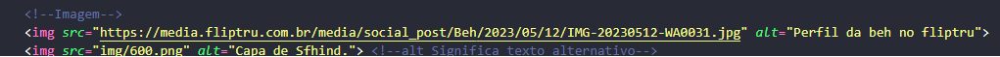
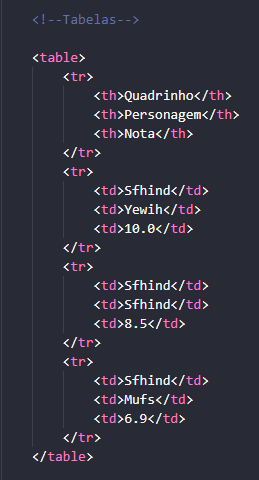
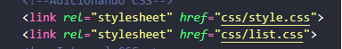

# Estudo de HTML

### Estou fazendo curso do Hora de Codar, na Udemy.

# Estrutura do HTML 

- DOCTYPE: Declara a versão do HTML; 
- html: Envolve todo o código HTML; 
- head: Colocamos todas as configurações de um site, como a importação de CSS e o título da página (meta tag);
- title: É a tag que define o título da página;
- body: onde todos os elementos visíveis estão;
- Para criar a estrutura HTML basta digitar o "!" e dar um enter.

## Atributos

Atributos podem ser utilizados para adicionar funcionalidades as tags.

- a: É responsavel por nos direcionar a uma nova página ou site, colocamos o endereço/URL no atributo chamado href. 
- Para abrir o link em uma outra aba usamos target = "_blank";
- alt: Nesse atributo é inserido um texto que descreve a imagem. Este recurso é importante para a acessibilidade, fazendo com que nosso site seja melhor rankeado pelo Google.

## Imagens

- Usa a tag img;
- Normalmente colocamos as imagens em uma pasta chamada "img" ou "assets", para fins de organização;
- Ela é uma self closing tag, ou seja não tem tag de fechamento. É bom inserir o atributo alt sempre que for por alguma imagem.   

# Listas

## Listas Ordenadas

- Podemos criar um menu a partir de uma lista;
- Usa-se a tag ol;
- Os itens continuam sendo com a tag il.

## Listas não Ordenadas

- Usa-se a tag ul;
- Cada item na lista é representado pela tag li.

# Tabelas

- Nós usamos tabelas para exibir dados que podem ser categorizados em colunas;
- tabelas são estruturas complexas no HTML e não são utilizadas;
- Precisamos da tag table para criar a tabela;
- E também um cabeçalho e um corpo;
- tr: Cada linha é criada em uma tag tr; 
- th: O cabeçalho (colunas);
- td: Ficam os dados;  

# Tag Div

- A tag é utilizada para criar divisões/seções no nosso site;
- Podemos criar elementos menores também, como cards;
- O principal propósito é: encapsular elementos que estão conectados entre si.

## Outras Tags

br: Quebra de linha;  
hr: Para linha horizontal;  

# CSS

## Anatomia do CSS

- Primeiramente devemos selecionar o elemento, isso pode ser feito através da tag do elemento;
- Depois precisamos colocar as propriedades e os valores;
- Caso queira mudar algo basta ulitlzar: color: red;;
- Nome da propriedade, dois pontos, valor, ponto e vírgula.

## Maneiras de adicionar o CSS ao HTML

- Inline: quando os estilos são adicionados por um atributo;

<code><pre>
EXEMPLO:  h1 style="color:blue">Mudando o título com inline h1
</pre></code>
Podemos também por multiplas regras:
<code><pre>
h1 style="color: purple; font-size: 40px">Mudando Tamanho h1
</pre></code>

- Internal: quando o CSS é adicionado na tag head;
É uma técnica melhor que o inline, os estilos são colocados na tag head e as regras precisam estar entre a tag style;  
p{  
    color: red;  
}

- External: quano o CSS é adicionado atrvaés de um arquivo externo e depois importado no HTML.
Para adicionar o CSS com esta técnica precisaremos criar um arquivo .css, geralmente ficam em uma pasta chamada css e ela é importada através da tag link.  

## Ordem do CSS
- Se temos estilos misturados (inline, internal e external), qual será aplicado? Todos eles, mas com a seguinte ordem: inline>internal=external>padrão do navegador;
- Esta regra funciona quando temos estilos em um mesmo elemento;
- Interno e externo tem a mesma prioridade, a última regra ganha a 'corrida'.

### Aplicando Múltiplos CSS

### Comentário em CSS:
/* Aqui está um comentário.*/

